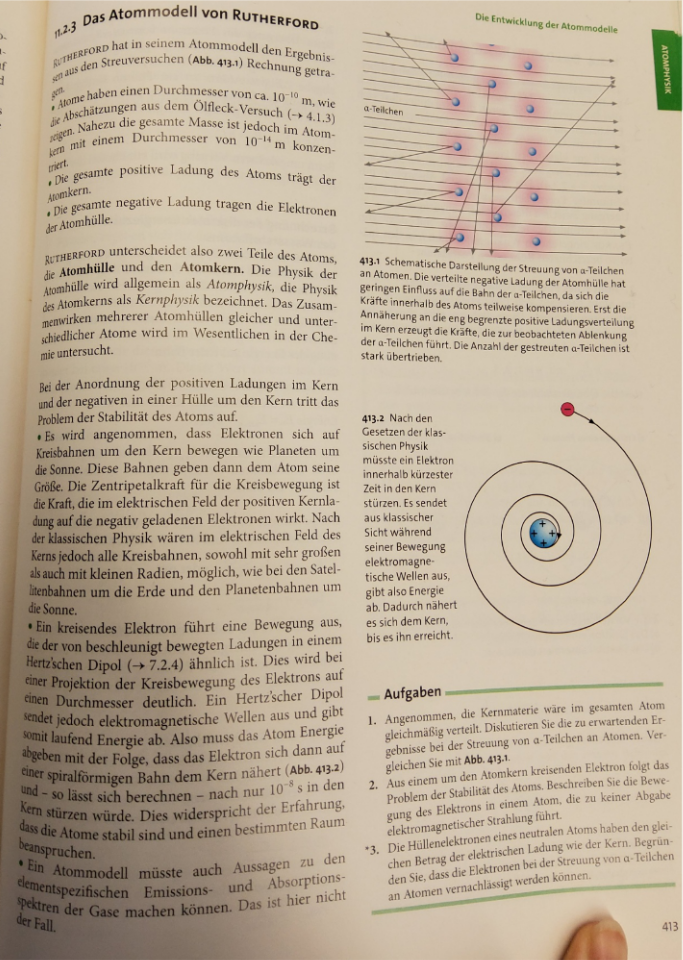
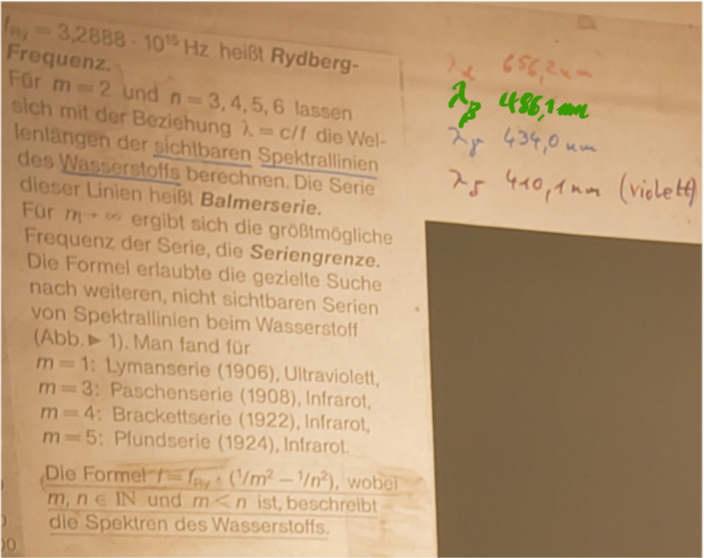
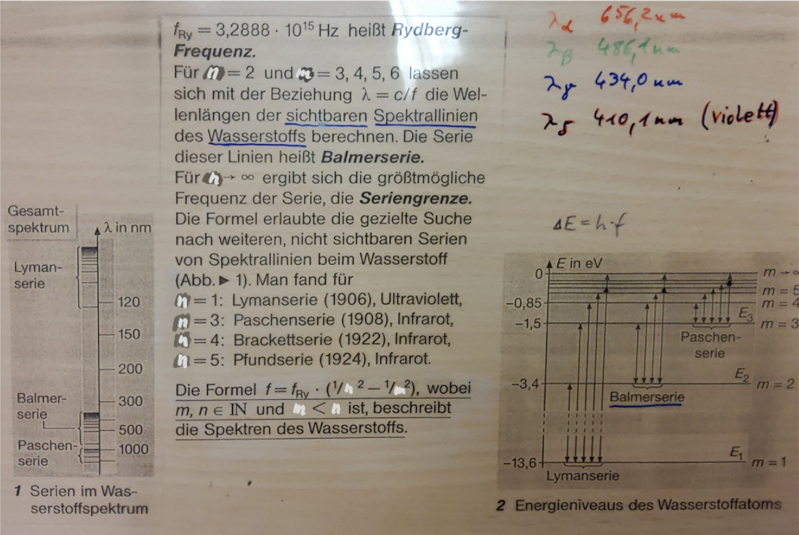
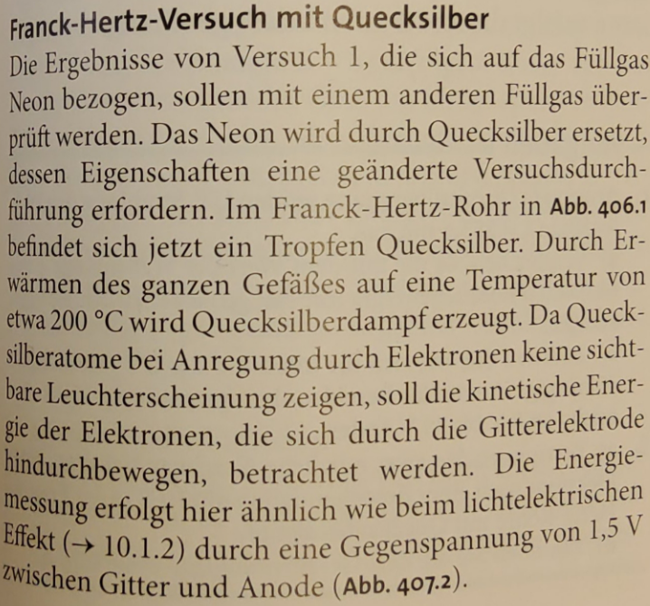
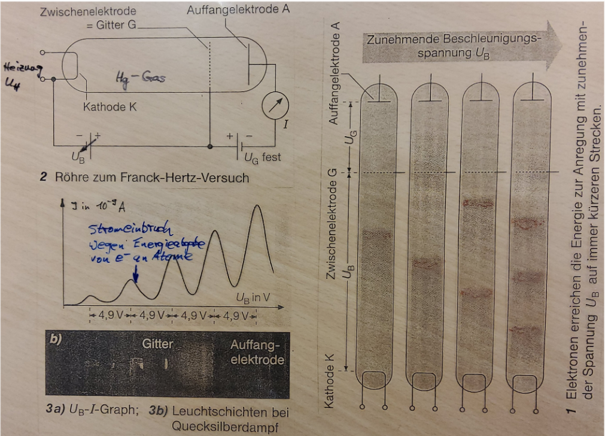
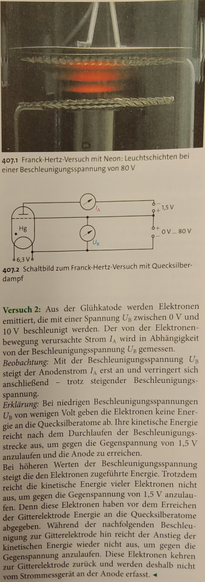
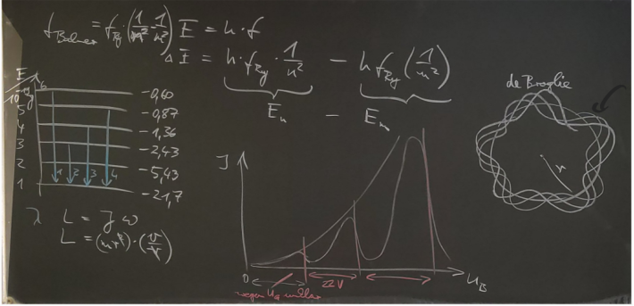

## Stirling Motor
1. Die unter Druck stehende Luft im Zylinder dehnt sich aus. Sie schiebt dabei den Arbeitskolben nach rechts. Die für diese Arbeit nötige Energie wird der Luft durch die Heizung zugeführt. Daher kühlt sich die Luft nicth ab; ihre Temperatur ist konstant (T_1). Der Verdrängerkolben bewegt sich kaum.
2. Der Arbeitskolben befindet sich äußerst rechts und bewegt sich praktisch nicht. Durch die Drehung des Schwungrades wird der Verdrängerkolben nach links bewegt. Er drängt die heiße Luft in den kalten Zylinderteil. Der Verdrängerkolben nimmt dabei Energie aus der Luft auf. Ihre Temperatur sinkt auf T_2.
3. Jetzt bewegt sich der Arbeitskolben nach links. Die Luft wird kompremiert. Anders alsbei der Luftpumpe wird sie dabei nicht erwärmt, weil Energie über die Kührlrippen abgeführt wird. Die Temperatur bleibt konstant (T_2). Der Verdrängerkolben bleibt in seiner Position.
4. Der Arbeitskolben ist wieder in Ruhe. Der Verdrängerkolben schiebt die (kompremierte) Luft in den heißen Zylinderteil zurück. Die Luft nimmt die im Verdrängerkolben gespeicherte Energie wieder auf. Ihre gespeicherte Temperatur steigt auf T_1. Der Vorgang beginnt von vorne.

## Fydberg-Frequenz
Wellenlängen von Emissionslinien
$$ f = f_{Ry} \cdot (\frac{1}{m^2} - \frac{1}{n^2}) $$
mit $m, n \in \mathbb{N}$ und m < n, beschreibt die Spektren des Wasserstoffs

verschiedene Untersuchungen in verschiedenen Wellenlängenbereichen (in Lymanserie, **Balmerserie**(->sichtbares Licht), Paschenserie, Backettserie, Pfundserie, ...)

- Bild: Energieniveaus des Wasserstoffs

- Aufgaben in Lb. S. 409
1. a)
   - m = 7:
     - 1. n = 8: $f = 1.57 \cdot 10^{13}$  $\qquad$ $\lambda = 19nm$
     - 1. n = 9: $f = 1.57 \cdot 10^{13}$ $\qquad$  $\lambda = 19nm$

3. 1.21, 1.1, 1.1, 1.05
$$ f = f_{0} \cdot (\dfrac{1}{3^2} - \dfrac{1}{m^2}) $$

## Frank-Hertz-Versuch
- nach J. Frankc und G. Hertz
- Glaskolben mit Quecksilbergas füllen und Luft rauspumpen
- zwei Heizungen
  1. Die Kathode heizen, um Elektronen rauszulösen
  2. Alles andere heizen, damit Quecksilbergas entsteht
- Insert picture here 
- Beschleunigung findet bis zur Zwischenelektrode = Gitter G statt
- danach: Elektronen werden durch Gegenfeld mit Gegenspannugn $U_g$ herausgefiltert, wenn sie zu wenig Energie haben
$$ f_{Bahner} = f_{Ry} \cdot (\dfrac{1}{n^2} - \dfrac{1}{n^2} = h \cdot f $$
$$ \Delta E = h \cdot f_{Ry} \cdot \dfrac{1}{n^2} - h \cdot f_{Ry} \cdot \dfrac{1}{m^2} = E_n - E_m $$

-----
### Aufgabe
- Differenz zwischen Maxima/Minima im Frank-Hertz-Versuch mit Helium 22V
- gesucht: Energie und Wellenlänge

## Bohr'sches Atommodell
### Bohr'sche Postulate
  1. Es gibt Bahnen, auf denen sich die Elektronenen Strahlungsfrei bewegen können \
  strahlungsfrei für Bahndrehimpuls
  $$ L = n \cdot \dfrac{h}{2 \pi} \qquad n = 1, 2, 3, ...  \qquad (L = \gamma m_ev_b)$$
   *  [nicht nach Bohr; später nach de Broglie
    $U = n \cdot \lambda_e$ \
    $2\pi r_n = n \cdot \dfrac{h}{m_ev_e}$ \
    v_n - Geschwindigkeit auf n-ter Bahn \
    L - Drehimpuls 
    ]

  2. Energiedifferenz ist $h \cdot f$
  $$ E_m - E_n = \Delta E = h \cdot f$$
  **Ansatz:**
  $$|F_R| = |F_C|$$
  $$\dfrac{m_ev_n^2}{r_n} = \dfrac{1}{4\pi\epsilon_0} \cdot \dfrac{z \cdot e^2}{r_n^2}$$
  mit $v_n^2 = (\dfrac{nh}{2\pi r_nm_e})^2)$
  $$ r_n = \dfrac{n^2h^2\cdot \epsilon_0}{\pi m_e e^2 \cdot z} $$

  Radien der Bahnen von Wasserstoff:
 1. $r_n \approx 5.3 \cdot 10^{-11}$
 2. $r_n \approx 2.1 \cdot  10^{-10}$
 3. $r_n \approx  4.8 \cdot 10^{-10}$

 Geschwindigkeit:
$$v_n = \dfrac{z \cdot e^2}{2 h \epsilon_0 n}$$
1. $v_n = 2.1 \cdot 10^6 \frac{m}{s}$
2. $v_n = 1.1 \cdot 10^6 \frac{m}{s}$

Bohr-Energie:
$$E_{pn} = \dfrac{1}{4\pi \epsilon_0} \cdot \dfrac{Q_1 Q_2 z}{r_n} = - \dfrac{e^2 z}{4\pi\epsilon_0} \cdot \dfrac{\pi e^2 z}{n^2h^2 \epsilon_0} = - \dfrac{m_e e^4 z^2}{4 \epsilon_0^2 h^2 n^2}$$
$$E_{kn} = \dfrac{m_e}{2} v_n^2 = \dfrac{m_e}{2} (\dfrac{e^2}{2h\epsilon_0 n})^2 = \dfrac{m_e e^4}{8 \epsilon_0^2 h^2 n^2} $$
$$E_n = E_k + E_p = - \dfrac{1}{8} \dfrac{m_e e^4 \cdot z^2}{e_0^2 h^2} \dfrac{1}{n^2} $$

-----
# 21. März - Zusammenfassungen und wenig Neues
- Ganz viel Stoffgebietswiederholung
- Herleitung Bohr-Bahnen

## Anordnung der Stoffe im Periodensystem
> Mit zunehmender Kernladung steigt die Anziehungskraft auf die Elektronen. Die Ionisierungsenergie müsste zunehmen. (-> Foto Ionisierungsnegie - Ordnungszahl Diagramm; auffällig: Ne - Na). \
> Das elfte Elektron vom Natrium msus sich auf einem höheren Energieniveau befinden, als das zehnte von Neon. \
> Das heißt, auch im Grundzustand können sich nicht alle Elektronen auf dem tiefsten Energieniveau befinden. \
> Für das zweite Elektron ändert sich die Ioniierungsenergie bei Berillium kaum. Bei Litium steigt sie dagegen stark an. Bei Litium steigt sie stark an.

- Aufspaltung jeder Schale in Unter-Schalen
- K Spalte: 1 Unterschale; L: 2; M: 2, N: 3; ...
- Siehe Tafelwerk Energieniveauschema der Atomorbitale
- Quantenzahlen:
  - Hauptquantenzahl $n$: Energieniveaus, quasi Bohrbahnen
  - Nebenquantenzahl $l$ : Winkelabhängigkeit, *Bahndrehimpulsquantenzahl*
  - Orientierungsquantenzahl/Magnetquantenzahl $m$: Orienterung im Raum
  - Spinquantenzahl $s$: $+\frac{1}{2}$ und $-\frac{1}{2}$ - Richtung des Eigendrehimpulses
  
$\Rightarrow$ Pauli-Prinzip 
> Alle Elektronen eines Atoms unterscheiden sich in mindestens einer Quantenzahl. Wir unterscheiden eine Hauptquantenzahl $n$, die Nebenquantenzahl $l$ (von 0 bis n - 1), die Orientierungs-/Magnetquantenzahl $m$ (-l, ..., -1, 0, 1, ..., l) und die Spinquantenzahl $s$ ($+\frac{1}{2}$, $-\frac{1}{2}$).

### Anzahl der Elektronen auf der n-ten Schale
> $2 \cdot n^2$

## Untersuchung von Röntgenstrahlen
- nur durch Interferenz an Kristallen möglich
- z.B. LiF-Kristall
- auf kontinuierlichem Graphenverlauf gibt es mehrere peaks
- -> abhängig von Anodenmaterial ,,charakteristische Röntgenstrahlung

> Manche Elektronen werden im elektrischen Feld der Atomkerne des Anodenmaterials abgebremst (vor der Wechselwirkung mit dem Kristall selbst). Dabei wird kinetische Energie der Elektronen in Strahlungsenergie umgesetzt. Da ein Elektron höchstens seine gesamte Energie auf einmal abgeben kann gibt es eine kurzwellige Grenze $\lambda_{Grenz}$ (Ab Schnittpunkt mit x-Achse).

$$E_{kmax} = E_{el.max} = e \cdot U_{Beschlg} = h \cdot f_{grenz} = h \cdot \dfrac{c}{\lambda_{Grenz}}$$
$$\lambda_{Grenz} = \dfrac{h \cdot c}{e \cdot U_B} $$

### Die   characteristische Strahlung
> Ein Teil wird von den Atomen absorbiert und als elektromagnetische Strahlung diskreter Wellenlängen abgegeben.
> * Elektronen dringen tief in Atom ein
> * Schlagen dort ein Elektron aus
> * von höheren Schichten fällt Elektron auf niedrigere Schale, usw.\
> Die Beschusselektronen dringen tief in die Hüllen des Anodenmaterials ein und können aus den niedrigsten Bahnen Elektronen herauslösen. Das Nachrutschen von Elektronen höherer Bahenn führt zur Aussendung von Strahlung $\Delta E = h \cdot f$ (Differnz zwischen den Bahnen, zwischen denen das Elektron gesprungen ist)

- k-$\alpha$-Sprung ist Sprung zwischen L und K Schale
- k-$\beta$-Sprung ist Sprung zwischen M und K Schale
- l-$\alpha$-Sprung ist zwischen L und M Schale
- ...

# Bilder

